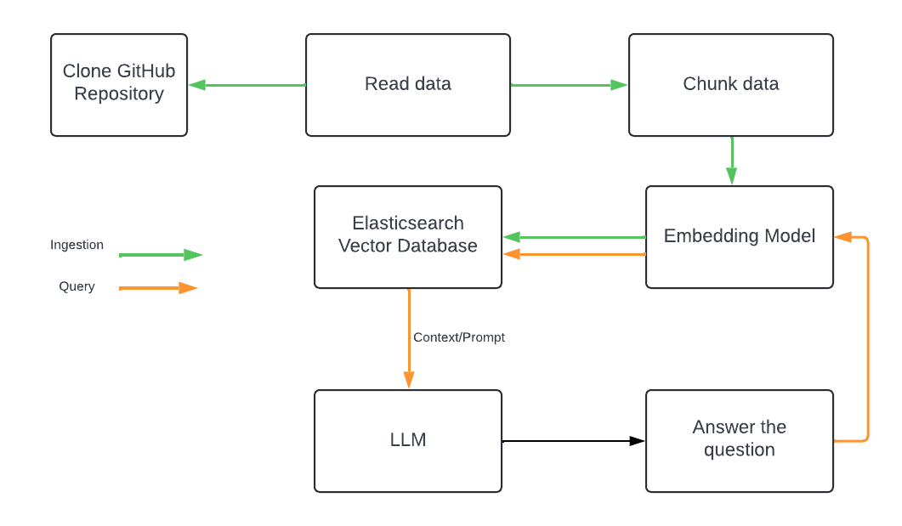

# GitHub  Assistant

Ask questions about your GitHub repository using RAG and natural language.

**Disclaimer**

That's not a production ready code, if you want to use this in production, make sure to:
- add Metadata on chunks using LLM
- Add personalized Prompts
- Evaluate other embeedings model
- Ensure you perform LLM output evaluation

_Remember, good data in, good data out._

This project allows you to interact with a specific GitHub repository as if you were having a conversation with it. Essentially, you can pose questions about the code directly to the repository.

Tools:
- **Elasticsearch**: Vector Database
- **LlamaIndex**: Framework for building LLM application
- **HuggingFace**: Host LLM models that can be consumed locally, in this project we're using `sentence-transformers/all-distilroberta-v1` model 

### Architecture



The process involves cloning a GitHub repository locally to the /tmp directory. The `SimpleDirectoryReader` is employed to load the cloned repository folder for indexing purposes. Additionally, metadata is incorporated to determine the file extensions. Subsequently, this metadata is partitioned into nodes and inserted into Elasticsearch which uses a HuggingFace model to generate embeddings from the inserted data.

### Installation

1. **Clone the Repository**:
   ```bash
   git clone https://github.com/framsouza/github-assistant.git
   cd github-assistant
    ```

2. **Install Required Libraries**:
    ```bash
    pip install -r requirements.txt
    ```
3. **Set Up Environment Variables**:
Update the `.env` file with your Elasticsearch credentials and the target GitHub repository details (eg, `GITHUB_TOKEN`, `GITHUB_OWNER`, `GITHUB_REPO`, `GITHUB_BRANCH`, `ELASTIC_CLOUD_ID`, `ELASTIC_USER`, `ELASTIC_PASSWORD`, `ELASTIC_INDEX`).

### Usage

1. **Index your data and create the embeddings by running**:
   ```bash
   python index.py
    ```

An Elasticsearch index will be generated, housing the embeddings. You can then connect to your ESS deployment and run search query against the index, you will see a new field named `embeddings`.

2. **Ask questions about your codebase by running**:
   ```bash
   python query.py
    ```
**Example:**
 ```
python query.py                                    
Please enter your query: Give me a detailed list of the external dependencies being used in this repository

 Based on the provided context, the following is a list of third-party dependencies used in the given Elastic Cloud on K8s project:
1. dario.cat/mergo (BSD-3-Clause, v1.0.0)
2. Masterminds/sprig (MIT, v3.2.3)
3. Masterminds/semver (MIT, v4.0.0)
4. go-spew (ISC, v1.1.2-0.20180830191138-d8f796af33cc)
5. elastic/go-ucfg (Apache-2.0, v0.8.8)
6. ghodss/yaml (MIT, v1.0.0)
7. go-logr/logr (Apache-2.0, v1.4.1)
8. go-test/deep (MIT, v1.1.0)
9. gobuffalo/flect (MIT, v1.0.2)
10. google/go-cmp (BSD-3-Clause, v0.6.0)
...

This list includes both direct and indirect dependencies as identified in the context.None
 ```

Questions you might want to ask:
- Give me a detailed description of what are the main functionalities implemented in the code?
- How does the code handle errors and exceptions?
- Could you evaluate the test coverage of this codebase and also provide detailed insights into potential enhancements to improve test coverage significantly?

Happy RAG!